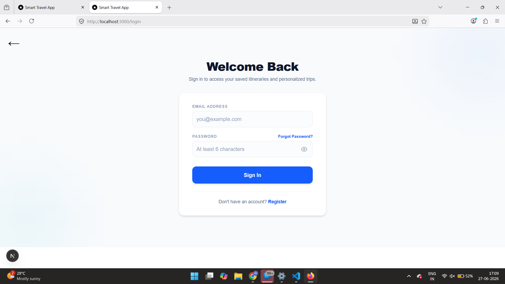
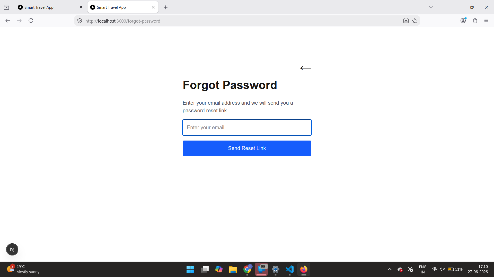
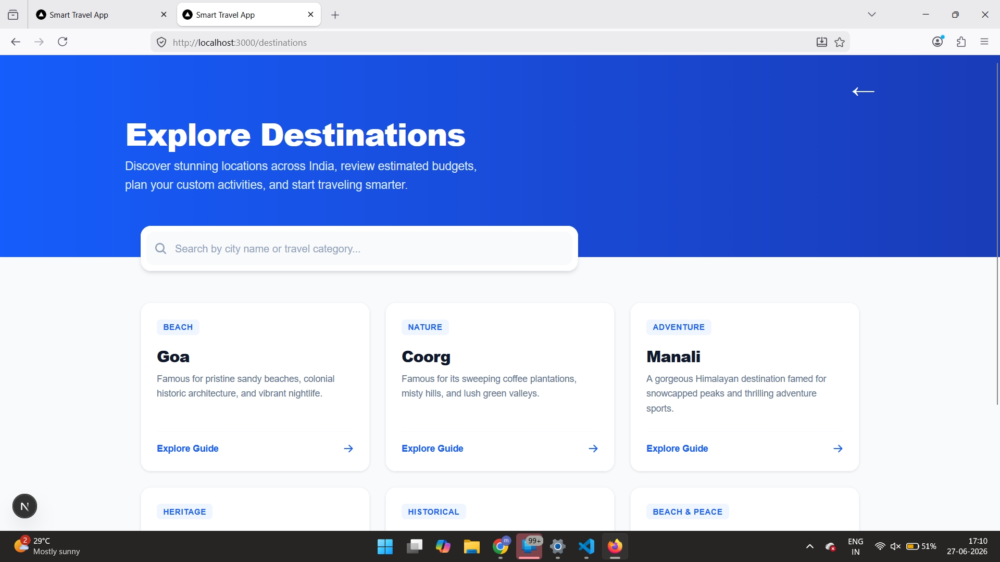
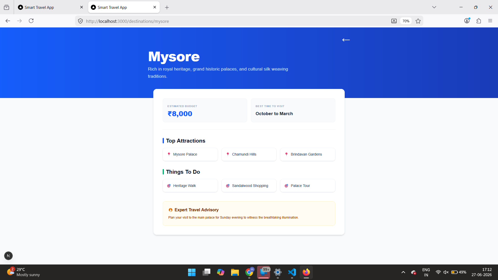
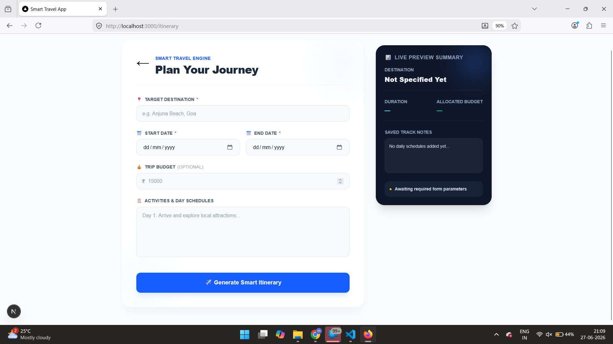
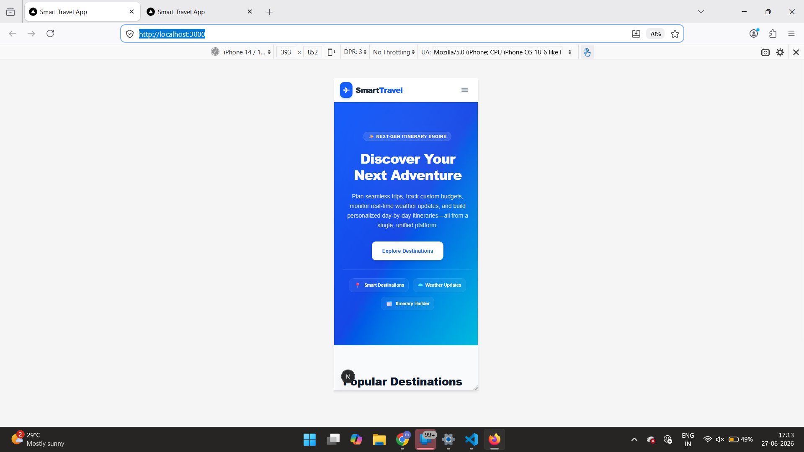

# Smart Travel Platform

A responsive travel planning web application built using Next.js, React, TypeScript, and Tailwind CSS.

## Project Overview

The Smart Travel Platform helps users discover travel destinations, view destination details, and plan personalized itineraries through a modern and responsive user interface.

---
## Screenshots

### Homepage


---

### Login



---

### Register


---

### Forgot Password



---

### Destinations



---

### Destination Details



---

### Itinerary Planner



---

### Mobile Responsive



## Phase 1 Features

### Homepage
- Responsive navigation bar
- Hero section
- Popular destinations
- Travel categories
- Featured recommendations
- Footer

### Authentication
- Login page
- Register page
- Forgot Password page

### Destination Search
- Search destinations
- Destination cards

### Destination Details
- Budget information
- Best time to visit
- Tourist attractions
- Things to do
- Travel tips

### Itinerary Planner
- Destination selection
- Travel dates
- Budget input
- Activity selection
- Trip summary

### Responsive Design
- Mobile responsive
- Tablet responsive
- Desktop responsive

---

## Technologies Used

- Next.js
- React
- TypeScript
- Tailwind CSS
- CSS
- Git
- GitHub

---

## Folder Structure

```
app/
components/
public/
```

---

## Installation

Clone the repository

```bash
git clone https://github.com/Meghanagj/smart-travel-platform.git
```

Install dependencies

```bash
npm install
```

Run the project

```bash
npm run dev
```

Open

```
http://localhost:3000
```

---

## Author

**Meghana G Janginavar**

Computer Science Engineering Graduate
